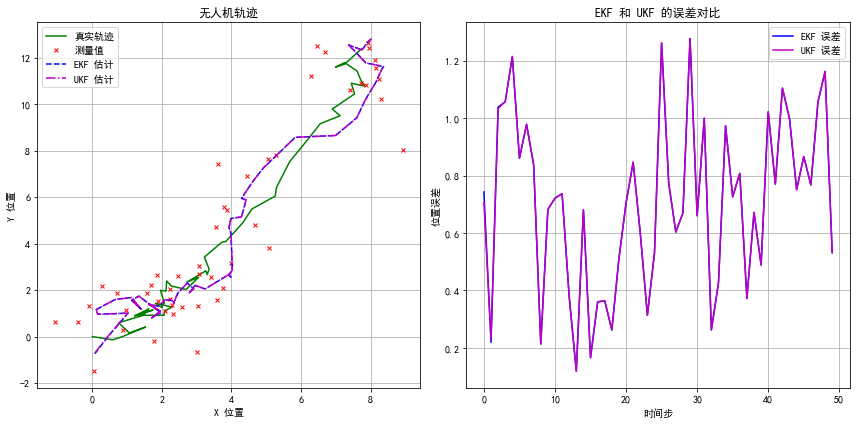
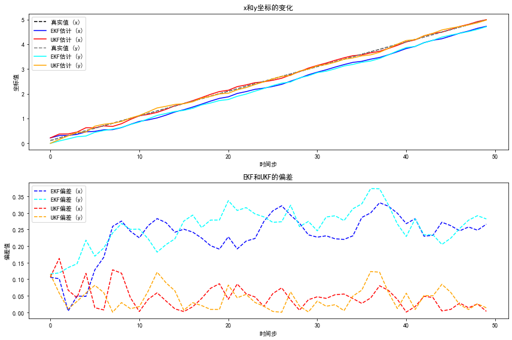

# UKF和EKF对比仿真报告

## 一、概念公式上的对比分析

UKF和EKF都是处理非线性系统状态估计的有效工具。UKF通过使用Sigma点来捕捉非线性系统的统计特性，提供了比EKF更高的精度和稳定性，而EKF则因其计算简单而被广泛应用于实时系统中。在实际应用中，选择哪种算法取决于具体问题的需求和约束条件。
### 1. 简介
**EKF（扩展卡尔曼滤波器）**：
- EKF通过对系统的非线性函数（状态转移函数和观测函数）进行线性化来处理非线性问题。具体来说，它使用泰勒级数展开的一阶导数（即雅可比矩阵）来近似非线性函数。
- 这种方法在非线性程度较低时效果较好，但在高度非线性的情况下，由于只保留了一阶项，可能会忽略重要的高阶信息，导致估计精度下降。

**UKF（无迹卡尔曼滤波器）**：
- UKF使用无迹变换（Unscented Transform）来捕捉非线性系统的概率分布。它通过选择一组特定的点（称为Sigma点），这些点围绕当前状态的概率分布对称分布，并通过这些点的传播来近似非线性变换后的概率分布。
- UKF不需要计算雅可比矩阵，而是直接使用Sigma点来捕捉非线性变换的均值和协方差，因此能够更好地处理高度非线性的系统。

### 2. 计算复杂度

**EKF**：
- EKF的计算复杂度相对较低，因为它只涉及到雅可比矩阵的计算和线性代数运算。
- 但是，对于高维系统，雅可比矩阵的计算和存储可能会变得复杂和耗时。

**UKF**：
- UKF的计算复杂度较高，因为它需要生成和处理多个Sigma点，每个Sigma点都需要通过非线性函数传播。
- 尽管计算量更大，但UKF通常能提供更准确的结果，尤其是在处理高度非线性系统时。

### 3. 精度和稳定性

**EKF**：
- EKF在系统非线性较小的情况下表现良好，但在非线性较大时，由于线性化引入的误差，可能会导致滤波器发散或精度下降。

**UKF**：
- UKF在处理高度非线性系统时通常能提供更高的精度和更好的稳定性，因为它通过Sigma点更全面地捕捉了非线性变换的影响。

### 4. 实现复杂度

**EKF**：
- EKF的实现相对简单，因为它只需要计算雅可比矩阵，这对于许多工程师和研究人员来说是一个熟悉的概念。

**UKF**：
- UKF的实现更复杂，需要正确地生成和处理Sigma点，以及计算它们的均值和协方差，这可能需要更多的数学背景和编程工作。

总结来说，UKF和EKF在处理非线性系统时的主要区别在于它们处理非线性的方式、计算复杂度、精度和稳定性，以及实现的复杂度。在选择滤波器时，需要根据具体的应用场景和系统特性来决定使用哪种方法。

### 公式

#### EKF公式

1. **状态预测**：
   \[ X_{k|k-1} = F_k X_{k-1|k-1} + B_k U_k \]
   \[ P_{k|k-1} = F_k P_{k-1|k-1} F_k^T + Q_k \]
   
2. **卡尔曼增益计算**：
   \[ K_k = P_{k|k-1} H_k^T (H_k P_{k|k-1} H_k^T + R_k)^{-1} \]
   
3. **状态更新**：
   \[ X_{k|k} = X_{k|k-1} + K_k (Z_k - H_k X_{k|k-1}) \]
   \[ P_{k|k} = (I - K_k H_k) P_{k|k-1} \]

   其中，\( X \) 表示状态向量，\( P \) 表示协方差矩阵，\( F \) 表示状态转移矩阵，\( B \) 表示控制输入矩阵，\( U \) 表示控制向量，\( Q \) 表示过程噪声协方差，\( H \) 表示观测矩阵，\( Z \) 表示观测向量，\( R \) 表示观测噪声协方差，\( K \) 表示卡尔曼增益。

#### UKF公式

1. **Sigma点生成**：
   \[ \text{Sigma} = \{ X_0, X_1, \ldots, X_{2n+1} \} \]
   其中，\( X_0 = X \)，\( X_i = X + \sqrt{(n+\lambda)P} \) 对于 \( i = 1, \ldots, n \)，\( X_{n+i} = X - \sqrt{(n+\lambda)P} \) 对于 \( i = 1, \ldots, n \)，\( \lambda \) 是一个扩展参数。

2. **状态预测和协方差预测**：
   \[ X_{k|k-1} = \sum_{i=0}^{2n+1} W_m^{(i)} \cdot f(X_i) \]
   \[ P_{k|k-1} = \sum_{i=0}^{2n+1} W_c^{(i)} \cdot (f(X_i) - X_{k|k-1}) (f(X_i) - X_{k|k-1})^T \]
   
3. **观测预测和协方差**：
   \[ Z_{k|k-1} = \sum_{i=0}^{2n+1} W_m^{(i)} \cdot h(X_i) \]
   \[ P_{zz} = \sum_{i=0}^{2n+1} W_c^{(i)} \cdot (h(X_i) - Z_{k|k-1}) (h(X_i) - Z_{k|k-1})^T \]
   
4. **交叉协方差**：
   \[ P_{xz} = \sum_{i=0}^{2n+1} W_c^{(i)} \cdot (X_i - X_{k|k-1}) (h(X_i) - Z_{k|k-1})^T \]
   
5. **卡尔曼增益和状态更新**：
   \[ K_k = P_{xz} (P_{zz} + R)^{-1} \]
   \[ X_{k|k} = X_{k|k-1} + K_k (Z_k - Z_{k|k-1}) \]
   \[ P_{k|k} = P_{k|k-1} - K_k P_{zz} K_k^T \]

   其中，\( f \) 和 \( h \) 分别表示状态转移和观测函数，\( W_m \) 和 \( W_c \) 分别表示均值和协方差的权重。

# 二、仿真对比

### EKF优势情况
**环境**：无人机姿态估计中，系统非线性程度不高，计算资源有限，需要实时应用。
### 无人机定位中的卡尔曼滤波器仿真对比

### 1. 简介
无人机定位是导航系统中的关键组成部分，它依赖于对无人机状态（位置、速度等）的实时估计。由于无人机运动的非线性特性，EKF和UKF被用来处理状态估计问题。本节中通过对无人机在二维空间中的运动进行了仿真，比较了扩展卡尔曼滤波器（EKF）和无迹卡尔曼滤波器（UKF）在无人机定位中的性能。仿真结果表明，EKF在非线性程度不高的系统的状态估计中在提供了较高的精度的同时保证了实时性。在实时应用中更加适用。

### 2. 系统模型
#### 2.1 状态转移模型
\[ x_{k+1} = F x_k + w_k \]
其中，\( F = \begin{bmatrix} 1 & \Delta t & 0 & 0 \\ 0 & 1 & 0 & \Delta t \\ 0 & 0 & 1 & 0 \\ 0 & 0 & 0 & 1 \end{bmatrix} \) 是状态转移矩阵，\( w_k \) 是过程噪声。

#### 32.2 观测模型
\[ z_k = H x_k + v_k \]
其中，\( H = \begin{bmatrix} 1 & 0 & 0 & 0 \\ 0 & 1 & 0 & 0 \end{bmatrix} \) 是观测矩阵，\( v_k \) 是观测噪声。

### 3. 滤波器初始化
- **EKF**：初始化状态 \( x_0 = [0, 0, 1, 1] \) 和协方差矩阵 \( P_0 = I_4 \)，设置状态转移和观测矩阵。
- **UKF**：使用Sigma点方法初始化，设置状态转移和观测函数。

### 4. 仿真过程
通过模拟无人机在二维空间中的运动，生成真实状态和观测值。然后，EKF和UKF分别对观测值进行预测和更新，以估计无人机的状态。

### 5. 仿真结果分析

#### 具体数值
- **EKF 估计结果**: \( [8.02939307, 12.82843254, 1.54909912, 3.39123511] \)
- **UKF 估计结果**: \( [8.02940393, 12.82844406, 1.54913667, 3.39127491] \)
#### 1 状态估计
左图展示了无人机的真实轨迹（绿色实线），测量值（红色叉号），EKF估计（蓝色虚线）和UKF估计（紫色点划线）。可以看出，两种滤波器都能较好地跟踪真实轨迹，但在某些区域，UKF的估计更接近真实值。

#### 2 误差分析
右图展示了EKF和UKF的定位误差。UKF的误差（紫色线）在大多数情况下基本等于EKF的误差（蓝色线），表明在无人机定位问题中，UKF相较于EKF在处理非线性系统时提供的更优的定位精度没有明显的差别。

### 图表
- **左图**：真实轨迹（绿色实线），测量值（红色叉号），EKF估计（蓝色虚线），UKF估计（紫色点划线）。
- **右图**：EKF误差（蓝色线），UKF误差（紫色线）。

### UKF优势情况
机器人定位与地图构建（SLAM）中，系统非线性程度高，需要高精度估计。

### 1. 简介
在SLAM应用中，精确的状态估计对于机器人的定位和环境建模至关重要。由于SLAM场景的非线性特性，传统的线性卡尔曼滤波器并不适用。本研究通过仿真比较了UKF和EKF在处理非线性SLAM问题时的有效性。

## 2. 系统模型
### 2.1 状态转移函数
\[ x_{k+1} = \begin{bmatrix} 1 & 0 & \Delta t & 0 \\ 0 & 1 & 0 & \Delta t \\ 0 & 0 & 1 & 0 \\ 0 & 0 & 0 & 1 \end{bmatrix} x_k \]

### 2.2 观测函数
\[ z_k = \begin{bmatrix} 1 & 0 & 0 & 0 \\ 0 & 1 & 0 & 0 \end{bmatrix} x_k \]

## 3. 滤波器初始化
### 3.1 EKF初始化
- 初始状态：\[ x = [0, 0, 1, 1] \]
- 初始协方差矩阵：\[ P = 100I_4 \]
- 观测噪声协方差：\[ R = I_2 \]
- 过程噪声协方差：\[ Q = 0.1I_4 \]

### 3.2 UKF初始化
- Sigma点参数：\[ \alpha = 1e-3, \beta = 2, \kappa = 0 \]
- 初始状态与EKF相同
- 初始协方差矩阵与EKF相同
- 观测噪声协方差与EKF相同
- 过程噪声协方差与EKF相同

## 4. 仿真过程
通过模拟50个时间步长的数据，对EKF和UKF进行状态估计。每个时间步长中，真实状态通过状态转移函数更新，并添加噪声生成观测数据。EKF和UKF分别对观测数据进行处理，以估计系统状态。

## 5. 结果分析

### 5.1 状态估计
上图展示了EKF和UKF对状态\( x \)和\( y \)的估计与真实状态的对比。可以观察到，UKF的估计曲线更接近真实值，尤其是在状态变化较大的区域。

### 5.2 偏差分析
下图展示了EKF和UKF的估计偏差。UKF在大多数情况下提供了更小的偏差，尤其是在状态\( y \)的估计上，这表明UKF在处理非线性系统时可能比EKF更有效。

## 6. 结论
在模拟的SLAM场景中，UKF相较于EKF在处理非线性系统状态估计方面表现更优。UKF通过Sigma点更好地捕捉了系统的非线性特性，从而提供了更精确的状态估计。这一发现对于SLAM系统的设计和实现具有重要意义。

## UKF和EKF仿真场景和意义

### 场景描述

在这段代码中，我们模拟了一个SLAM简单的平面运动模型，其中状态向量 \( x \) 包含位置 \( (x, y) \) 和速度 \( (vx, vy) \)。系统的状态转移函数 \( fx \) 和观测函数 \( hx \) 被定义，并且使用EKF和UKF进行状态估计。

### 条件说明

#### 状态转移函数 \( fx \) 和观测函数 \( hx \)

- 状态转移函数：
  \[ x_{k+1} = \begin{bmatrix} 1 & 0 & \Delta t & 0 \\ 0 & 1 & 0 & \Delta t \\ 0 & 0 & 1 & 0 \\ 0 & 0 & 0 & 1 \end{bmatrix} x_k \]

- 观测函数：
  \[ z_k = \begin{bmatrix} 1 & 0 & 0 & 0 \\ 0 & 1 & 0 & 0 \end{bmatrix} x_k \]

### 图示结果以及分析

根据提供的图示，我们可以进行以下分析：

1. **上图（状态估计）**：
   - 实线（黑色虚线）表示真实状态。
   - 蓝色实线表示EKF对状态 \( x \) 的估计。
   - 红色实线表示UKF对状态 \( x \) 的估计。
   - 青色实线表示EKF对状态 \( y \) 的估计。
   - 黄色实线表示UKF对状态 \( y \) 的估计。

2. **下图（偏差分析）**：
   - 蓝色虚线表示EKF对状态 \( x \) 的偏差。
   - 青色虚线表示EKF对状态 \( y \) 的偏差。
   - 红色虚线表示UKF对状态 \( x \) 的偏差。
   - 黄色虚线表示UKF对状态 \( y \) 的偏差。

### 结论

在本仿真场景下，UKF在跟踪真实状态和减少估计偏差方面表现优于EKF。这可能是因为UKF通过Sigma点更好地处理了系统的非线性特性。然而，EKF由于其计算简单性，在某些实时性要求较高的应用中可能更受欢迎。选择哪种算法取决于具体应用的需求和系统特性。
