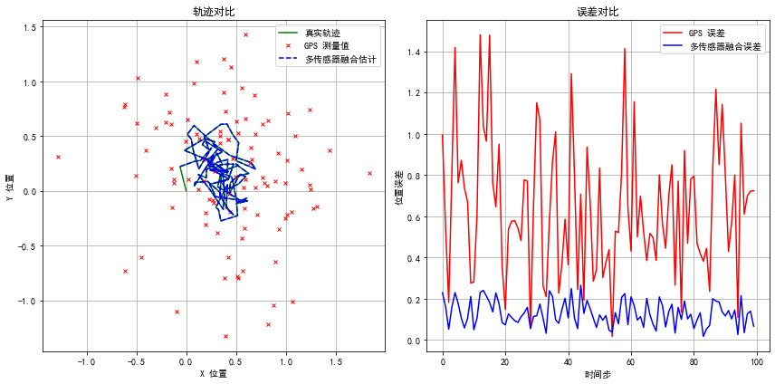

# 卡尔曼滤波多传感器融合在机器人运动估计中的应用报告

### 简介
在机器人运动估计中，多传感器融合是提高状态估计精度的关键技术。卡尔曼滤波器作为一种递归算法，能够有效融合不同传感器的数据，减少噪声影响，提供更准确的状态估计。
通过仿真实验，详细分析了卡尔曼滤波器在多传感器融合中应用于机器人运动估计的有效性。通过融合IMU、里程计、GPS和LiDAR的数据，卡尔曼滤波器能够提供比单一传感器更准确的状态估计。仿真结果验证了卡尔曼滤波器在处理具有非线性特性的机器人运动模型中的性能。

### 1. 仿真环境
仿真环境基于Python语言，利用FilterPy库中的卡尔曼滤波器实现。机器人在二维空间中的运动通过状态转移和观测模型来模拟。

### 2. 传感器数据仿真
#### 2.1 IMU 数据
IMU 提供加速度和角速度测量值。
- 加速度测量值 \( acc_x, acc_y \) 仿真公式：\[ acc_x = v_x \cdot \cos(\theta) + \mathcal{N}(0, 0.1) \]
- 角速度测量值 \( gyro_z \) 仿真公式：\[ gyro_z = \mathcal{N}(0, 0.05) \]

#### 2.2 里程计数据
里程计提供机器人的位移和速度信息。
- 位移增量 \( \delta_x, \delta_y \) 仿真公式：\[ \delta_x = v_x \cdot dt + \mathcal{N}(0, 0.1) \]
- 速度 \( v_x, v_y \) 

#### 2.3 GPS 数据
GPS 提供全局位置信息。
- 位置 \( gps_x, gps_y \) 仿真公式：\[ gps_x = x + \mathcal{N}(0, 0.5) \]
- \( gps_y = y + \mathcal{N}(0, 0.5) \)

#### 2.4 LiDAR 数据
LiDAR 提供局部环境中的位置信息。
- 位置 \( lidar_x, lidar_y \) 仿真公式：\[ lidar_x = x + \mathcal{N}(0, 0.2) \]
- \( lidar_y = y + \mathcal{N}(0, 0.2) \)

### 3. 系统模型
#### 3.1 状态转移模型
\[ x_{k+1} = F x_k + w_k \]
其中，状态转移矩阵 \( F \) 为：
\[ F = \begin{bmatrix} 1 & 0 & dt & 0 & 0 \\ 0 & 1 & 0 & dt & 0 \\ 0 & 0 & 1 & 0 & 0 \\ 0 & 0 & 0 & 1 & 0 \\ 0 & 0 & 0 & 0 & 1 \end{bmatrix} \]

#### 3.2 观测模型
\[ z_k = H x_k + v_k \]
其中，观测矩阵 \( H \) 为：
\[ H = \begin{bmatrix} 1 & 0 & 0 & 0 & 0 & 0 & 1 & 0 & 0 \\ 0 & 1 & 0 & 0 & 0 & 0 & 1 & 0 & 0 \\ 0 & 0 & 1 & 0 & 0 & 0 & 0 & 1 & 0 \\ 0 & 0 & 0 & 1 & 0 & 0 & 0 & 0 & 1 \\ 1 & 0 & 0 & 0 & 1 & 0 & 0 & 0 \\ 0 & 1 & 0 & 0 & 0 & 0 & 1 & 0 \end{bmatrix} \]

### 4. 滤波器初始化
- **状态向量维度**: 5 (\( x, y, v_x, v_y, \theta \))
- **观测向量维度**: 8 (\( \delta_x, \delta_y, v_x, v_y, gps_x, gps_y, lidar_x, lidar_y \))
- **过程噪声协方差矩阵**: \( Q = \text{diag}([0.1, 0.1, 0.1]) \)
- **观测噪声协方差矩阵**: \( R = \text{diag}([0.5, 0.5, 0.5, 0.5, 0.5, 0.5, 0.5, 0.5]) \)
- **初始状态**: \( x_0 = [0, 0, 1, 1, 0] \)
- **初始协方差**: \( P_0 = \text{diag}([1.0, 1.0, 1.0, 1.0, 1.0]) \)

### 5. 仿真过程
通过模拟机器人在二维空间中的运动，生成真实状态和观测值。然后，卡尔曼滤波器对观测值进行预测和更新，以估计机器人的状态。

### 6. 结果分析

#### 6.1 状态估计
左图展示了机器人的真实轨迹（绿色实线），GPS测量值（红色叉号），以及多传感器融合估计（蓝色虚线）。可以看出，卡尔曼滤波器能够较好地跟踪真实轨迹。

#### 6.2 误差分析
右图展示了GPS误差（红色线）和多传感器融合误差（蓝色线）。卡尔曼滤波器融合后的误差明显小于GPS单独测量的误差，表明融合方法在减少误差方面的优势。

#### 7. 结论
卡尔曼滤波器在多传感器融合中提供了一种有效的方法来提高机器人运动估计的精度。通过融合IMU、里程计、GPS和LiDAR的数据，卡尔曼滤波器能够减少噪声的影响，提供更准确的状态估计。

### 附录
#### 附录A: 仿真代码
```
import numpy as np
from filterpy.kalman import KalmanFilter
import matplotlib.pyplot as plt

# 初始化卡尔曼滤波（多传感器融合）
dim_x = 5  # 状态向量维度 [x, y, v_x, v_y, theta]
dim_z = 8  # 观测向量维度 [delta_x, delta_y, v_x, v_y, gps_x, gps_y, lidar_x, lidar_y]
kf = KalmanFilter(dim_x=dim_x, dim_z=dim_z)

# 状态转移矩阵
dt = 0.1  # 时间步长
kf.F = np.array([[1, 0, dt, 0, 0],
                 [0, 1, 0, dt, 0],
                 [0, 0, 1, 0, 0],
                 [0, 0, 0, 1, 0],
                 [0, 0, 0, 0, 1]])

# 观测矩阵
kf.H = np.array([[1, 0, 0, 0, 0],  # 里程计 delta_x
                 [0, 1, 0, 0, 0],  # 里程计 delta_y
                 [0, 0, 1, 0, 0],  # 里程计 v_x
                 [0, 0, 0, 1, 0],  # 里程计 v_y
                 [1, 0, 0, 0, 0],  # GPS x
                 [0, 1, 0, 0, 0],  # GPS y
                 [1, 0, 0, 0, 0],  # LiDAR x
                 [0, 1, 0, 0, 0]]) # LiDAR y

# 过程噪声协方差矩阵
kf.Q = np.eye(dim_x) * 0.1

# 观测噪声协方差矩阵
kf.R = np.eye(dim_z) * 0.5

# 初始状态和协方差
kf.x = np.array([0, 0, 1, 1, 0])  # [x, y, v_x, v_y, theta]
kf.P = np.eye(dim_x) * 1.0

# 模拟传感器数据
def simulate_sensors(true_state):
    # 真实状态
    x, y, v_x, v_y, theta = true_state
    
    # IMU 数据（加速度和角速度）
    acc_x = v_x * np.cos(theta) + np.random.normal(0, 0.1)
    acc_y = v_y * np.sin(theta) + np.random.normal(0, 0.1)
    gyro_z = np.random.normal(0, 0.05)  # 角速度噪声
    
    # 里程计数据（位移增量和速度）
    delta_x = v_x * dt + np.random.normal(0, 0.1)
    delta_y = v_y * dt + np.random.normal(0, 0.1)
    odom_v_x = v_x + np.random.normal(0, 0.1)
    odom_v_y = v_y + np.random.normal(0, 0.1)
    
    # GPS 数据
    gps_x = x + np.random.normal(0, 0.5)
    gps_y = y + np.random.normal(0, 0.5)
    
    # LiDAR 数据
    lidar_x = x + np.random.normal(0, 0.2)
    lidar_y = y + np.random.normal(0, 0.2)
    
    return np.array([delta_x, delta_y, odom_v_x, odom_v_y, gps_x, gps_y, lidar_x, lidar_y])

# 仿真过程
true_states = []
measurements = []
kf_states = []
for _ in range(100):
    # 真实状态更新
    true_state = kf.x.copy()
    true_states.append(true_state)
    kf.predict()
    
    # 生成传感器数据
    z = simulate_sensors(true_state)
    measurements.append(z)
    
    # 卡尔曼滤波更新
    kf.update(z)
    kf_states.append(kf.x.copy())

# 提取结果
true_x = [s[0] for s in true_states]
true_y = [s[1] for s in true_states]
gps_x = [z[4] for z in measurements]  # GPS x
gps_y = [z[5] for z in measurements]  # GPS y
kf_x = [s[0] for s in kf_states]
kf_y = [s[1] for s in kf_states]

# 计算误差
gps_errors = [np.sqrt((tx - gx)**2 + (ty - gy)**2) for tx, ty, gx, gy in zip(true_x, true_y, gps_x, gps_y)]
kf_errors = [np.sqrt((tx - kx)**2 + (ty - ky)**2) for tx, ty, kx, ky in zip(true_x, true_y, kf_x, kf_y)]

# 可视化
plt.figure(figsize=(12, 6))
# 绘制轨迹
plt.rcParams['font.sans-serif'] = ['SimHei']  # 使用黑体
plt.rcParams['axes.unicode_minus'] = False  # 解决负号显示问题
# 轨迹对比
plt.subplot(1, 2, 1)
plt.plot(true_x, true_y, 'g-', label='真实轨迹')
plt.plot(gps_x, gps_y, 'rx', label='GPS 测量值', markersize=4)
plt.plot(kf_x, kf_y, 'b--', label='多传感器融合估计')
plt.xlabel('X 位置')
plt.ylabel('Y 位置')
plt.title('轨迹对比')
plt.legend()
plt.grid(True)

# 误差对比
plt.subplot(1, 2, 2)
plt.plot(gps_errors, 'r-', label='GPS 误差')
plt.plot(kf_errors, 'b-', label='多传感器融合误差')
plt.xlabel('时间步')
plt.ylabel('位置误差')
plt.title('误差对比')
plt.legend()
plt.grid(True)

plt.tight_layout()
plt.show()]
```
